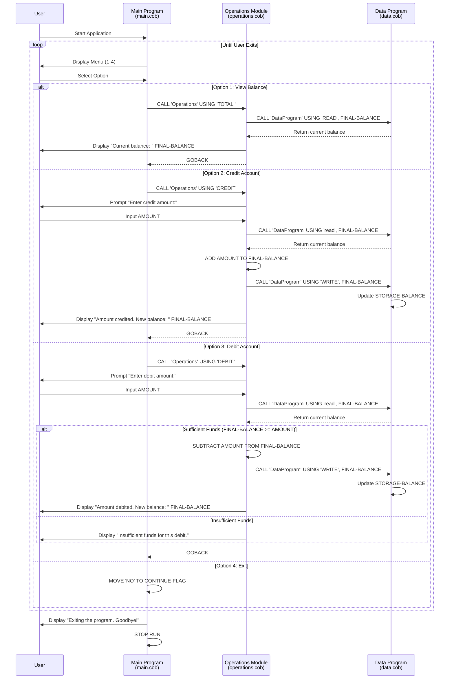
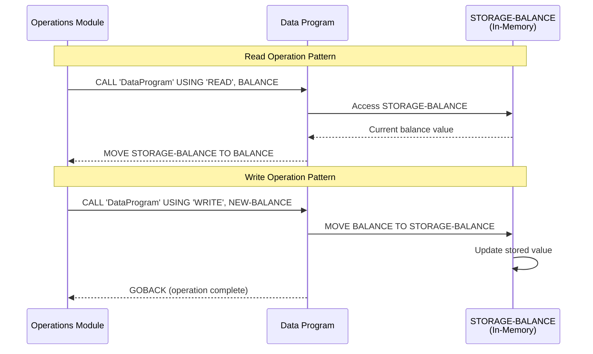
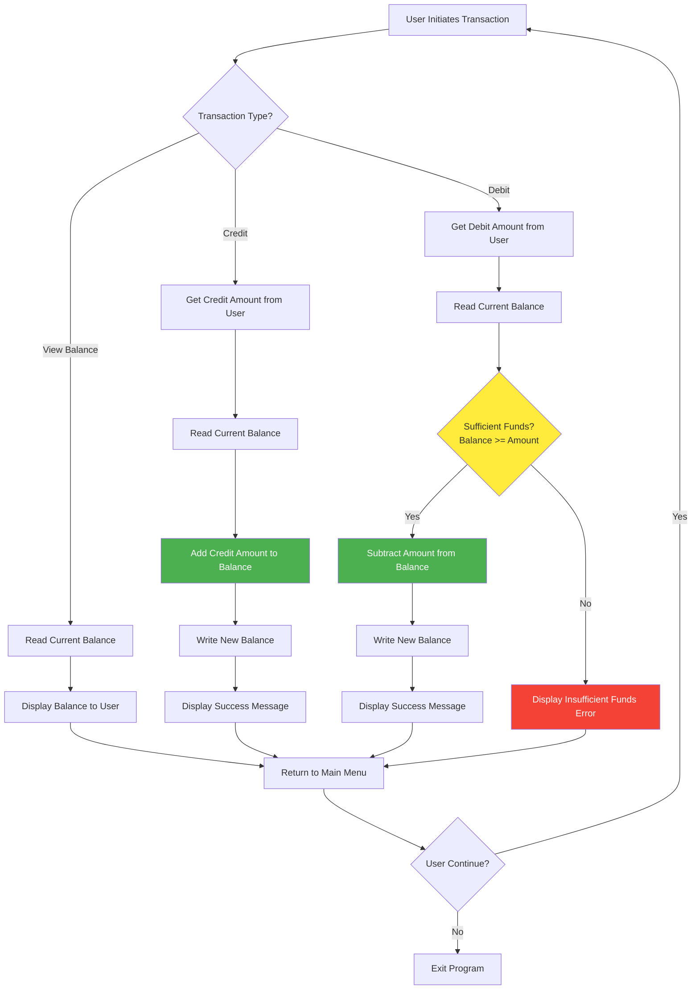

# COBOL Account Management System Documentation

## Overview

This is a legacy COBOL-based Account Management System designed to handle basic student account operations including balance inquiries, credit transactions, and debit transactions. The system follows a modular architecture with three main components working together to provide a complete account management solution.

## System Architecture

The system is composed of three COBOL programs that work together:

1. **MainProgram** (`main.cob`) - User interface and menu system
2. **Operations** (`operations.cob`) - Business logic and transaction processing
3. **DataProgram** (`data.cob`) - Data access layer for balance storage

## File Documentation

### main.cob - Main Program (Entry Point)

**Purpose**: Serves as the primary user interface and menu-driven entry point for the account management system.

**Key Functions**:

- Displays the main menu with available options
- Captures user input for menu selection
- Routes user requests to appropriate operations
- Manages the main application loop

**Business Rules**:

- Menu options are limited to 4 choices (1-4)
- Invalid menu selections prompt the user to retry
- The system continues running until the user explicitly chooses to exit
- All operations are performed through the Operations module

**Data Structures**:

- `USER-CHOICE`: Single digit (PIC 9) to store menu selection
- `CONTINUE-FLAG`: 3-character field (PIC X(3)) to control program flow

**Menu Options**:

1. View Balance - Calls Operations with 'TOTAL ' parameter
2. Credit Account - Calls Operations with 'CREDIT' parameter
3. Debit Account - Calls Operations with 'DEBIT ' parameter
4. Exit - Terminates the program

### operations.cob - Operations Module

**Purpose**: Contains the core business logic for all account operations including balance checks, credits, and debits.

**Key Functions**:

- **Balance Inquiry**: Retrieves and displays current account balance
- **Credit Processing**: Adds funds to the account
- **Debit Processing**: Removes funds from the account with overdraft protection

**Business Rules**:

#### Credit Operations

- Accepts any positive amount for credit
- No upper limit validation on credit amounts
- Immediately updates the account balance
- Displays confirmation with new balance

#### Debit Operations

- **Overdraft Protection**: Prevents debits that would result in negative balance
- Validates sufficient funds before processing
- Only processes debit if `FINAL-BALANCE >= AMOUNT`
- Displays "Insufficient funds" message for invalid debits
- Shows new balance only for successful transactions

#### Balance Inquiries

- Retrieves current balance from data storage
- Displays balance without modification
- No authentication or access control

**Data Structures**:

- `OPERATION-TYPE`: 6-character field (PIC X(6)) for operation identification
- `AMOUNT`: Decimal field (PIC 9(6)V99) supporting up to $9999.99 transactions
- `FINAL-BALANCE`: Decimal field (PIC 9(6)V99) with default value of $1000.00

**Integration**:

- Receives operation type via LINKAGE SECTION from MainProgram
- Calls DataProgram for all read/write operations
- Uses 'READ' and 'WRITE' commands to interact with data layer

### data.cob - Data Program (Data Access Layer)

**Purpose**: Provides centralized data storage and retrieval functionality for account balance management.

**Key Functions**:

- **Read Operations**: Returns current stored balance to calling program
- **Write Operations**: Updates stored balance with new value
- Maintains persistent balance data during program execution

**Business Rules**:

- **Default Balance**: All accounts start with $1000.00
- **In-Memory Storage**: Balance is stored in working storage (not persistent across program restarts)
- **Atomic Operations**: Each read/write operation is independent
- **No Validation**: Data layer accepts any balance value passed to it

**Data Structures**:

- `STORAGE-BALANCE`: Primary balance storage (PIC 9(6)V99) with $1000.00 default
- `OPERATION-TYPE`: Operation identifier received from calling program
- `BALANCE`: Linkage parameter for balance data transfer

**Interface**:

- Accepts two parameters: operation type ('READ' or 'WRITE') and balance value
- 'READ' operation: Returns `STORAGE-BALANCE` to caller
- 'WRITE' operation: Updates `STORAGE-BALANCE` with provided value

## Student Account Business Rules Summary

1. **Initial Balance**: All student accounts begin with $1000.00
2. **Overdraft Protection**: Students cannot withdraw more than their available balance
3. **Transaction Limits**: Individual transactions are limited to $9999.99 due to field size constraints
4. **No Authentication**: System does not require student ID or password verification
5. **Session-Based**: Balance data is only maintained during program execution
6. **Unlimited Credits**: No restrictions on deposit amounts (within field constraints)
7. **Real-Time Updates**: All transactions are processed immediately
8. **Error Handling**: System provides user-friendly messages for insufficient funds

## Technical Constraints

- **Numeric Precision**: Monetary values support 2 decimal places
- **Amount Limits**: Maximum transaction/balance of $999,999.99
- **Memory-Only Storage**: No persistent data storage between program executions
- **Single User**: System designed for single concurrent user
- **No Audit Trail**: No transaction history or logging capabilities

## Usage Flow

1. User starts MainProgram
2. Main menu displays with 4 options
3. User selects desired operation (1-4)
4. MainProgram calls Operations with appropriate parameter
5. Operations module processes request and calls DataProgram as needed
6. Results are displayed to user
7. Process repeats until user selects exit option

## Future Modernization Considerations

- Add persistent data storage (database integration)
- Implement user authentication and authorization
- Add transaction logging and audit trails
- Enhance error handling and validation
- Add support for multiple account types
- Implement account limits and business rule configuration
- Add reporting and analytics capabilities

## System Data Flow Diagrams

### Overall System Flow

### Data Access Pattern

### Business Rule Enforcement Flow

